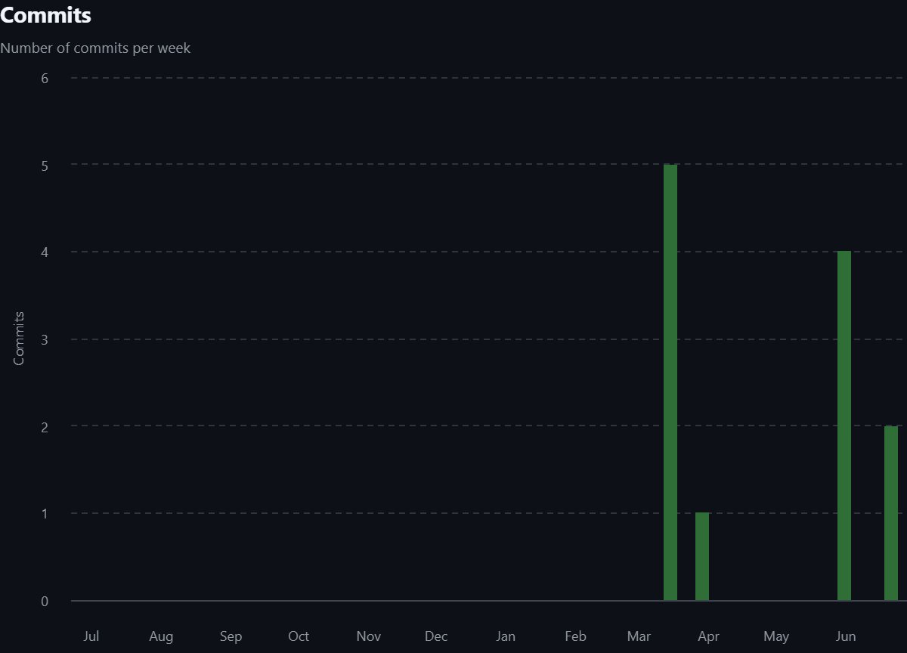
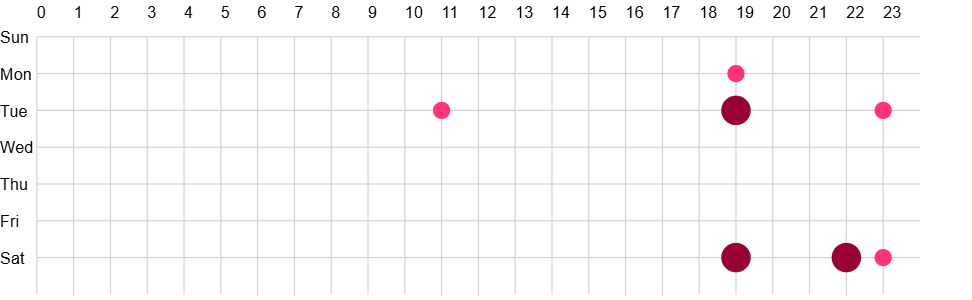

# 📱 IMT Калькулятор — Мобильное приложение

---

## 📌 Общая информация

**Автор:** [Тугусова Мария Александровна]  
**Группа:** [ПИЖ-б-о-23-2]  
**Траектория:** Mobile  
**Дата начала:** [01.04.2026]  
**Дата сдачи:** [22.06.2026]

---

## 🧠 Описание проекта

IMT Калькулятор — это мобильное приложение для расчёта индекса массы тела (BMI/ИМТ).  
Пользователь вводит параметры тела, получает результат расчёта и категорию здоровья, а также может сохранять историю измерений.

Система состоит из мобильного клиента и серверной части с REST API и базой данных PostgreSQL.

---

## 📱 Траектория выполнения

- [ ] Веб-разработка (React + Spring Boot)  
- [ ] Десктоп  
- [x] Мобильная  
- [ ] Enterprise  

---

## 🧰 Технологический стек

| Компонент | Технология |
|-----------|------------|
| Мобильный клиент | React Native 0.81.5 + Expo ~54.0.33 |
| Бэкенд | Java 17 + Spring Boot 3.2.0 |
| База данных | PostgreSQL (bmi_db, порт 5432) |
| ORM | Spring Data JPA + Hibernate |
| Безопасность | JWT (jjwt 0.11.5) + BCrypt |
| API документация | OpenAPI 3 / Swagger UI (springdoc 2.3.0) |
| Тесты | JUnit 5 + MockMvc + H2 in-memory |
| Покрытие | JaCoCo 0.8.11 (48%) |
| Сборка | Maven, Expo CLI |
| Инструменты | Git, Postman, SonarQube |

---

## 🏗 Требования к окружению

Требование	Версия
Java JDK	17+
Node.js	18+
PostgreSQL	15+
Maven	3.8+
Docker (опционально)	20+

---

## 🚀 Быстрый старт
📌 База данных

bash
psql -U postgres -c "CREATE DATABASE bmi_db;"
psql -U postgres -c "ALTER USER postgres PASSWORD '123';"

🖥 Бэкенд
cd backend
mvn spring-boot:run

📍 http://localhost:8082

📱 Мобильное приложение
cd frontend
npm install
npx expo start

🧪 Тесты
cd backend
mvn test

📊 JaCoCo: target/site/jacoco/index.html

---

## 🔌 REST API

| Метод | Endpoint | Описание |
|------|----------|----------|
| POST | `/api/auth/register` | Регистрация |
| POST | `/api/auth/login` | Вход |
| GET | `/api/users/me` | Профиль |
| PUT | `/api/users/me` | Обновить профиль |
| POST | `/api/bmi/calculate` | Расчёт ИМТ |
| GET | `/api/bmi/history` | История |
| GET | `/api/bmi/stats` | Статистика |
| DELETE | `/api/bmi/{id}` | Удаление |

📘 Swagger UI: http://localhost:8082/swagger-ui.html  
📘 OpenAPI: http://localhost:8082/api-docs  

---

## 📦 Структура проекта

Вся проектная документация структурирована по папкам в соответствии с этапами разработки. Ниже представлено содержание каждого раздела:

### 📋 00-project-charter — Паспорт проекта
- **[Паспорт проекта](docs/00-project-charter/Паспорт_проекта.md)**
- **[IDEF0-диаграмма](docs/00-project-charter/IDEF0.md)**
- **[BUC-диаграмма](docs/00-project-charter/BUC.md)**
- **[SWOT-анализ](docs/00-project-charter/SWOT.md)**
- **[ROI-расчет](docs/00-project-charter/ROI.md)**

### 📝 01-requirements — Требования
- **[Use Case Diagram](docs/01-requirements/Use_Case_Diagram.md)**
- **[Domain Model](docs/01-requirements/Domain_Model.md)**
- **[Трассировка требований](docs/01-requirements/Трассировка_требований.md)**

### 🏗 02-architecture — Архитектура
- **[PCMEF-архитектура](docs/02-architecture/PCMEF.md)**
- **[ADR (Architecture Decision Records)](docs/02-architecture/ADR.md)**
- **[Интерфейсы системы](docs/02-architecture/Интерфейсы.md)**

### 🗄 03-database — База данных
- **[ER-диаграмма](docs/03-database/ER-диаграмма.md)**
- **[DDL-скрипты](docs/03-database/DDL.md)**
- **[ORM-сущности](docs/03-database/ORM.md)**

### 🔍 04-detailed-design — Детальное проектирование
- **[Sequence-диаграммы](docs/04-detailed-design/Sequence_диаграммы.md)**
- **[Спецификация методов](docs/04-detailed-design/Спецификация_методов.md)**

### 💻 05-implementation — Реализация
- **[Реализация слоев приложения](docs/05-implementation/Реализация_слоев.md)**

### 🧪 06-testing — Тестирование
- **[Тест-план](docs/06-testing/Тест-план.md)**
- **[Отчет JaCoCo](docs/06-testing/JaCoCo.md)**
- **[Postman-коллекция](docs/06-testing/Postman.md)**

### 🔧 07-refactoring — Рефакторинг
- **[«Запахи» кода и их устранение](docs/07-refactoring/Запахи_кода.md)**
- **[Data Mapper](docs/07-refactoring/Data_Mapper.md)**
- **[Identity Map](docs/07-refactoring/Identity_Map.md)**

### 🎨 08-ui — Пользовательский интерфейс
- **[Скриншоты интерфейсов](docs/08-ui/Скриншоты.md)**

### 📡 09-api — API
- **[OpenAPI-спецификация](docs/09-api/OpenAPI.md)**
- **[Swagger UI](docs/09-api/Swagger.md)**

### 🚀 10-deployment — Развертывание
- **[Docker-конфигурация](docs/10-deployment/Docker.md)**
- **[CI/CD-пайплайн](docs/10-deployment/CI_CD.md)**
- **[Администрирование системы](docs/10-deployment/Администрирование.md)**

### 📖 11-user-guide — Руководство пользователя
- **[Руководство пользователя](docs/11-user-guide/Руководство_пользователя.md)**

### 📄 12-final-report — Итоговые материалы
- **[Пояснительная записка](docs/12-final-report/Пояснительная_записка.md)**

---

Система построена на архитектурном паттерне PCMEF (Presentation-Control-Mediator-Entity-Foundation).

### 📍 Распределение слоёв

| Слой | Расположение | Ответственность |
|------|--------------|------------------|
| Presentation (P) | React Native (мобильное устройство) | UI, отображение, ввод данных, офлайн-кэш |
| Control (C) | Spring Boot | REST API, валидация DTO, маршрутизация |
| Mediator (M) | Spring Boot | Бизнес-логика, транзакции, расчёт ИМТ |
| Entity (E) | Spring Boot | JPA-сущности, бизнес-методы (calculateBmi, getCategory) |
| Foundation (F) | Spring Boot | Репозитории, доступ к БД |

---

## 📊 Статистика разработки

### Git метрики

| Метрика | Значение |
|---------|----------|
| Всего коммитов | 9 |
| Период разработки | 01.03.2026 – 01.06.2026 |
| Средняя частота |  0.8 коммита/неделю |
| Покрытие тестами (JaCoCo) | 48% |

---

### График активности

*Рисунок 1 — Активность коммитов в течение семестра*

### Тепловая карта

*Рисунок 2 — Распределение коммитов по дням и часам*

---

## Авторы

[Тугусова Мария] — разработчик, документация 
Группа [ПИЖ-б-о-23-2], email: [mtugusova@bk.ru], GitHub: [iceinveinssss]

---

## Лицензия

MIT License

Этот проект распространяется под лицензией MIT. Подробности в файле [LICENSE](LICENSE).

---
## Полезные ссылки

- [Репозиторий проекта](https://github.com/username/bmi-calculator)
- [Документация (docs/)](docs/)
- [Swagger UI](http://localhost:8082/swagger-ui.html)
- [Postman коллекция](docs/09-api/postman-collection.json)

---
