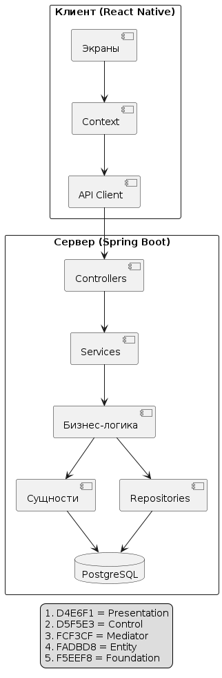

# Этап 2: Архитектурное проектирование

**Проект:** ИМТ Калькулятор  
**Недели:** 5–6

---

## 1. Обоснование выбора PCMEF

Архитектурный паттерн **PCMEF** выбран по следующим причинам:

- **Строгое разделение ответственности** — каждый слой отвечает только за свою зону; нарушения правила фиксируются на код-ревью.
- **Направленность зависимостей сверху вниз** (P→C→M→E→F) — циклические зависимости исключены.
- **Тестируемость** — бизнес-логика в слое M независима от HTTP (C) и БД (F); тесты используют H2 вместо PostgreSQL.
- **Коммуникация через интерфейсы** — `IBmiService` и `IUserService` задают явные контракты между C и M.
- **Адаптируемость** — сервер реализует C/M/E/F; мобильный клиент — адаптированный P.

---

## 2. Диаграмма пакетов PCMEF



*Рисунок 1 — Диаграмма пакетов PCMEF*

---

## 3. Ответственность слоёв

| Слой | Пакет / Путь | Классы | Ответственность | Запрещено |
|---|---|---|---|---|
| **C** | `com.bmi.control` | AuthController, BmiController, UserController, AdminController | Обработка HTTP, валидация входных данных | Обращаться к репозиториям напрямую |
| **M (интерфейсы)** | `com.bmi.mediator` | IBmiService, IUserService | Контракты между C и M | — |
| **M (реализации)** | `com.bmi.mediator.impl` | BmiServiceImpl, UserServiceImpl | Бизнес-логика, `@Transactional` | Знать о HTTP / контроллерах |
| **E** | `com.bmi.entity` | User, BmiRecord | JPA-сущности, `@PrePersist`, статические бизнес-методы `calculateBmi()`, `getCategory()` | Содержать логику доступа к данным |
| **F** | `com.bmi.foundation` | UserRepository, BmiRecordRepository | Spring Data JPA, SQL-запросы | Содержать бизнес-правила |

---

## 4. Интерфейсы между слоями (контракты C → M)

### IBmiService (`com.bmi.mediator`)

```java
public interface IBmiService {
    BmiRecord calculateAndSave(Long userId, BmiRequest request);
    List<BmiRecord> getHistory(Long userId);
    BmiRecord getById(Long id, Long userId);
    BmiRecord updateRecord(Long id, Long userId, BmiRequest request);
    void deleteRecord(Long id, Long userId);
    BmiStatsResponse getStats(Long userId);
    List<BmiRecord> search(Long userId, String category);
}
```

### IUserService (`com.bmi.mediator`)

```java
public interface IUserService {
    AuthResponse register(RegisterRequest request);
    AuthResponse login(LoginRequest request);
    User getUserById(Long id);
    User updateProfile(Long id, UpdateProfileRequest request);
    List<User> getAllUsers();
}
```

### UserRepository (`com.bmi.foundation`)

```java
public interface UserRepository extends JpaRepository<User, Long> {
    Optional<User> findByEmail(String email);
    boolean existsByEmail(String email);
}
```

### BmiRecordRepository (`com.bmi.foundation`)

```java
public interface BmiRecordRepository extends JpaRepository<BmiRecord, Long> {
    List<BmiRecord> findByUserIdOrderByMeasuredAtDesc(Long userId);
    Optional<BmiRecord> findByIdAndUserId(Long id, Long userId);
    List<BmiRecord> findByUserIdAndCategoryContainingIgnoreCaseOrderByMeasuredAtDesc(
        Long userId, String category);
    long countByUserId(Long userId);
}
```

---

## 5. Архитектурные решения (ADR)

### ADR-01: React Native + Expo для мобильного клиента

| | |
|---|---|
| **Статус** | Принято |
| **Контекст** | Необходимо кроссплатформенное приложение для iOS и Android |
| **Решение** | React Native 0.81.5 + Expo ~54.0.33 |
| **Обоснование** | Единая кодовая база; Expo упрощает сборку без Xcode/Android Studio; `expo-secure-store` для защищённого хранения токена |
| **Компромисс** | Чуть ниже производительность по сравнению с нативными приложениями |

### ADR-02: JWT вместо сессий

| | |
|---|---|
| **Статус** | Принято |
| **Решение** | jjwt 0.11.5, HMAC-SHA, claims: email + userId + role, срок 24 ч |
| **Обоснование** | Stateless-архитектура; подходит для REST API; токен хранится на клиенте в `SecureStore` |
| **Реализация** | `JwtUtil.generateToken()` → `JwtFilter extends OncePerRequestFilter` → `SecurityContext` |

### ADR-03: Бизнес-методы в Entity

| | |
|---|---|
| **Статус** | Принято |
| **Решение** | Статические методы `BmiRecord.calculateBmi()` и `BmiRecord.getCategory()` размещены в слое E |
| **Обоснование** | Логика расчёта ИМТ неотделима от сущности; сервис (`BmiServiceImpl`) делегирует вычисления в Entity |

### ADR-04: AsyncStorage + SecureStore для оффлайн-режима

| | |
|---|---|
| **Статус** | Принято |
| **Решение** | `authStorage.js`: `SecureStore` на iOS/Android, `AsyncStorage` на web; кэш данных — `AsyncStorage` |
| **Обоснование** | `SecureStore` шифрует чувствительные данные (токен, профиль); `AsyncStorage` — для несекретного кэша |

---

## 6. Диаграмма зависимостей

```
AuthController   ──► IUserService  ──► UserServiceImpl  ──► UserRepository       ──► PostgreSQL
BmiController    ──► IBmiService   ──► BmiServiceImpl   ──► BmiRecordRepository  ──► PostgreSQL
UserController   ──► IUserService
AdminController  ──► IUserService
                                       BmiServiceImpl   ──► BmiRecord.calculateBmi()  (Entity)
                                       BmiServiceImpl   ──► BmiRecord.getCategory()   (Entity)

Правило: зависимости строго P→C→M→E→F. Циклических зависимостей нет.
```

---

## 7. Структура проекта

```
backend/src/main/java/com/bmi/
├── control/              # C — REST-контроллеры
│   ├── AuthController.java
│   ├── BmiController.java
│   ├── UserController.java
│   └── AdminController.java
├── mediator/             # M — интерфейсы (контракты)
│   ├── IBmiService.java
│   └── IUserService.java
├── mediator/impl/        # M — реализации бизнес-логики
│   ├── BmiServiceImpl.java   (@Service, @Transactional)
│   └── UserServiceImpl.java  (@Service, @Transactional)
├── entity/               # E — JPA-сущности с бизнес-методами
│   ├── User.java             (getAge(), @PrePersist)
│   └── BmiRecord.java        (calculateBmi(), getCategory(), @PrePersist)
├── foundation/           # F — репозитории
│   ├── UserRepository.java
│   └── BmiRecordRepository.java
├── dto/                  # DTO объекты
│   ├── BmiRequest.java
│   ├── BmiStatsResponse.java
│   ├── AuthResponse.java
│   ├── RegisterRequest.java
│   ├── LoginRequest.java
│   └── UpdateProfileRequest.java
├── security/             # JWT-инфраструктура
│   ├── JwtUtil.java
│   └── JwtFilter.java
└── config/               # Spring-конфигурация
    └── SecurityConfig.java

frontend/src/
├── screens/              # P — 8 экранов (AppNavigator)
├── api/                  # API-клиент (Axios)
│   ├── client.js
│   ├── auth.js
│   ├── bmi.js
│   └── user.js
├── context/              # Глобальное состояние
│   ├── AuthContext.js
│   └── SettingsContext.js
├── navigation/
│   └── AppNavigator.js
├── storage/              # Локальное хранилище
│   ├── authStorage.js
│   └── cacheKeys.js
├── theme/
│   ├── colors.js
│   └── useTheme.js
└── utils/
    └── units.js
```
