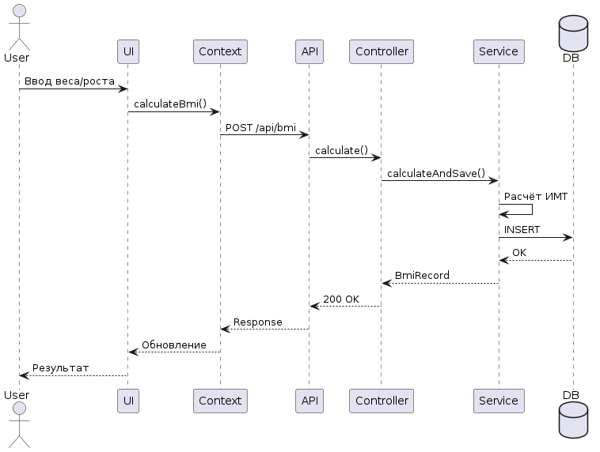
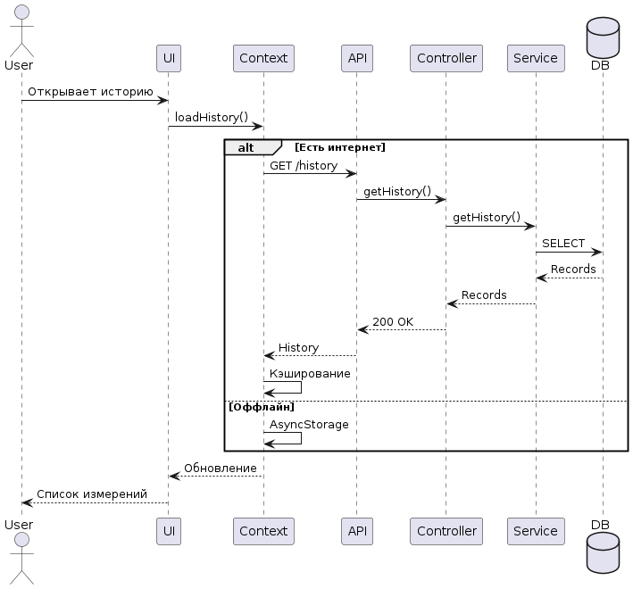
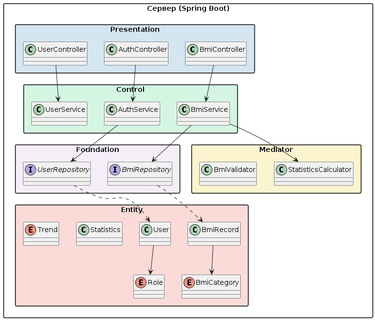

# Этап 4: Детальное проектирование

**Проект:** ИМТ Калькулятор  
**Недели:** 9–10

---

## 1. Диаграммы последовательности

### UC-03 / UC-04: Диаграмма последовательности: расчёт ИМТ



*Рисунок 1 — Use Case диаграма*

### UC-02: Диаграмма последовательности: просмотр истории



*Рисунок 2 — Use Case диаграма*

## 2. Диаграмма классов проектирования



*Рисунок 3 — Диаграмма классов проектирования*

## 3. Применение паттернов проектирования (GoF)

### Repository (Data Access Object)

`UserRepository` и `BmiRecordRepository` реализуют паттерн Repository: бизнес-логика (M) работает только с интерфейсами Spring Data JPA, конкретная реализация может быть заменена без изменения вышестоящих слоёв. Метод `findByIdAndUserId()` встраивает проверку владельца прямо в запрос.

### Template Method (`JwtFilter`)

`JwtFilter extends OncePerRequestFilter` — шаблонный метод Spring Security. Переопределяется `doFilterInternal()`: извлекает токен из заголовка `Authorization: Bearer <token>`, вызывает `JwtUtil.isValid()`, затем `extractEmail()` / `extractUserId()` / `extractRole()` и устанавливает `SecurityContextHolder`.

### Facade (`BmiServiceImpl`)

`BmiServiceImpl` — фасад, скрывающий за интерфейсом `IBmiService` сложность: расчёт через `BmiRecord.calculateBmi()`, определение категории через `BmiRecord.getCategory()`, работу с репозиторием и формирование ответа.

### Strategy (расчёт категории ИМТ)

Метод `BmiRecord.getCategory(double bmi)` реализует стратегию классификации: 7 последовательных условий по граничным значениям ВОЗ (16.0, 18.5, 25.0, 30.0, 35.0, 40.0).

---

## 4. Спецификация ключевых методов

### `BmiServiceImpl.calculateAndSave()`

```
Вход: userId: Long, req: BmiRequest {weight: Double (кг), height: Double (см)}

1. userRepository.findById(userId) → User (или RuntimeException)
2. bmi = BmiRecord.calculateBmi(req.weight, req.height)
     = Math.round((weight / (height/100)^2) * 10.0) / 10.0
3. category = BmiRecord.getCategory(bmi)  [7 градаций ВОЗ]
4. BmiRecord.builder()...build()
5. bmiRecordRepository.save(record) → @PrePersist устанавливает measuredAt
6. return сохранённая запись

Выход: BmiRecord (id, weight, height, bmi, category, measuredAt)
Исключения: RuntimeException("Пользователь не найден") → 500
```

### `UserServiceImpl.login()`

```
Вход: req: LoginRequest {email: String, password: String}

1. userRepository.findByEmail(req.email) → User
   или RuntimeException("Пользователь не найден")
2. passwordEncoder.matches(req.password, user.password)
   если false → RuntimeException("Неверный пароль")
3. jwtUtil.generateToken(email, userId, role.name())
   = HMAC-SHA подпись, claims: sub=email, userId, role, iat, exp
4. AuthResponse.builder().token(token).userId(id).name(name)
   .email(email).role(role.name()).build()

Выход: AuthResponse
Исключения: RuntimeException → 500 (обрабатывается глобально)
```

### `BmiServiceImpl.getStats()`

```
Вход: userId: Long

1. records = findByUserIdOrderByMeasuredAtDesc(userId)
2. Если пусто → BmiStatsResponse {totalMeasurements=0}
3. avg = Stream.mapToDouble(getBmi).average()
4. min = Stream.mapToDouble(getBmi).min()
5. max = Stream.mapToDouble(getBmi).max()
6. averageBmi = Math.round(avg * 10.0) / 10.0
7. currentCategory = records.get(0).getCategory()  [последнее измерение]

Выход: BmiStatsResponse {totalMeasurements, averageBmi, minBmi, maxBmi, currentCategory}
```

---

## 5. Схема обработки ошибок

| Ситуация | HTTP-статус | Причина |
|---|---|---|
| Неверный пароль / email не найден | 500 → рекомендуется 400/401 | `RuntimeException` без `@ExceptionHandler` |
| Отсутствует / недействительный JWT | 403 Forbidden | `JwtFilter` не устанавливает `SecurityContext` |
| Запрос к `/api/admin/**` с ролью USER | 403 Forbidden | `SecurityConfig.hasRole("ADMIN")` |
| Запись не найдена или чужая | 500 → рекомендуется 404 | `RuntimeException("Запись не найдена")` |
| Email уже зарегистрирован | 500 → рекомендуется 409 | `RuntimeException("Email уже зарегистрирован")` |
