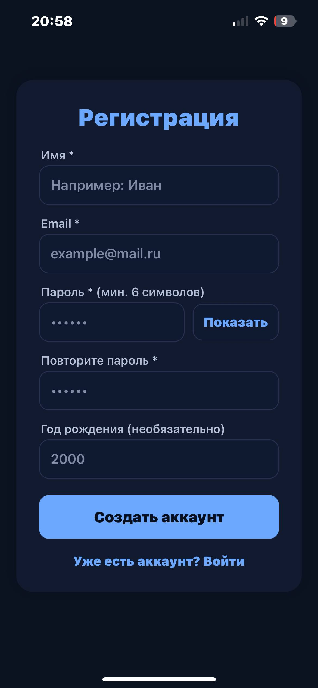
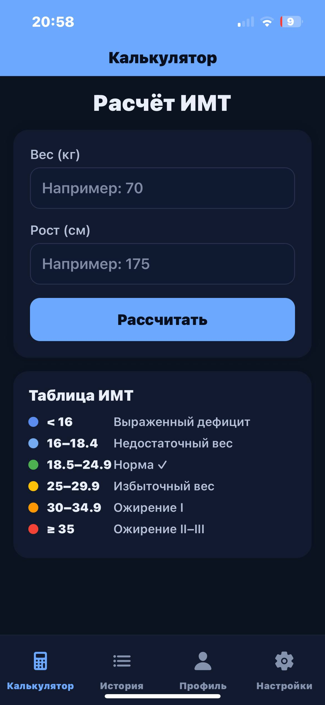
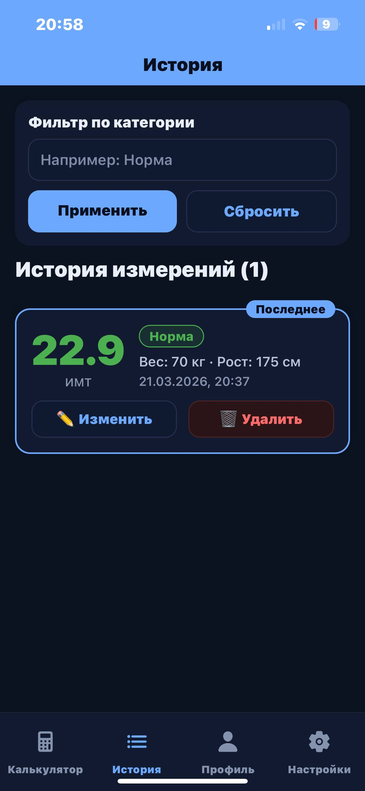
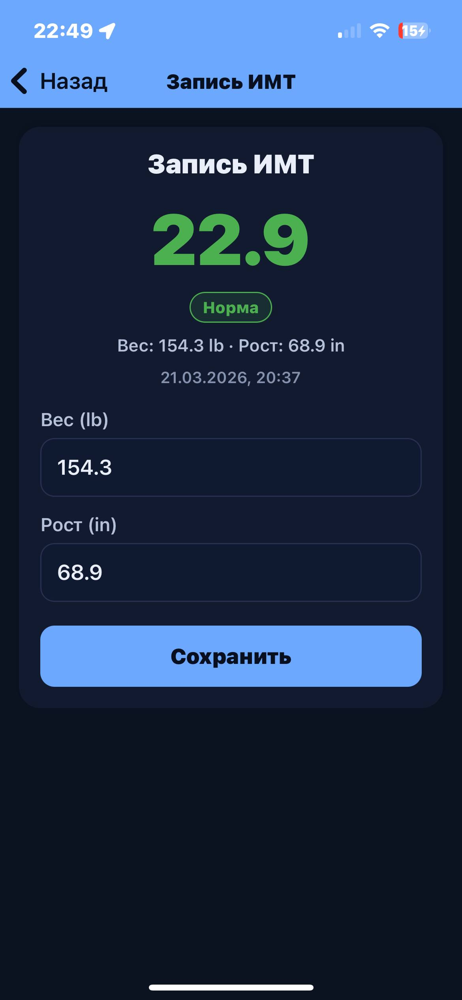
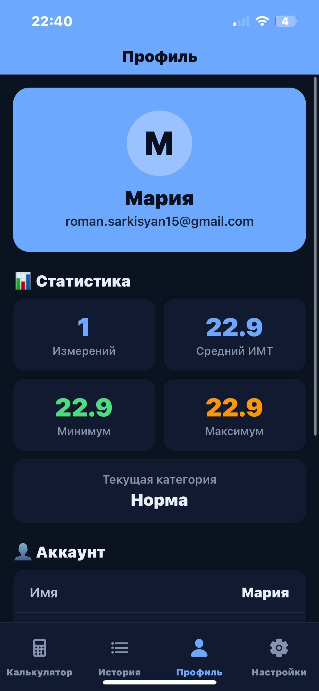
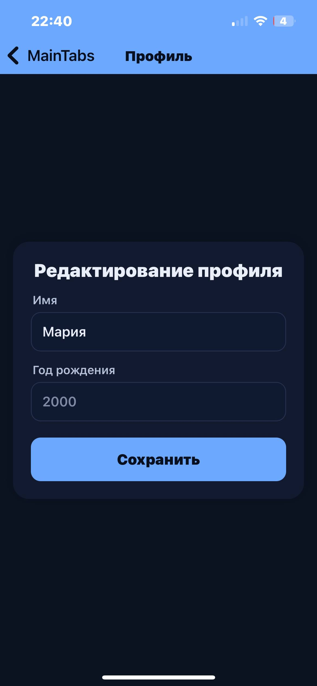
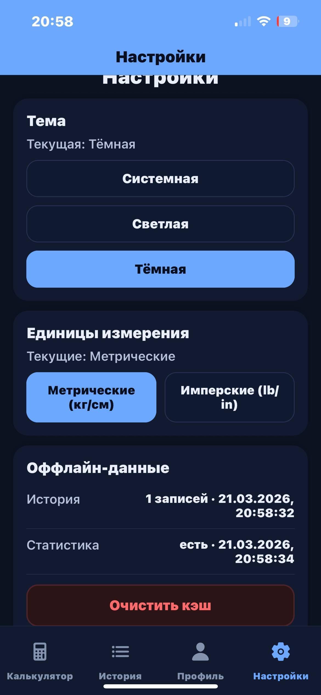

# Этап 7: Пользовательский интерфейс (Траектория В — Мобильная)

**Проект:** ИМТ Калькулятор  
**Недели:** 15–16

---

## 1. Навигационная структура (`AppNavigator.js`)

```
AppNavigator (NavigationContainer)
│
├── [user == null] AuthStack (Stack.Navigator, headerShown: false)
│   ├── Login      → LoginScreen.js
│   └── Register   → RegisterScreen.js
│
└── [user != null] MainStack (Stack.Navigator)
    ├── MainTabs (headerShown: false)
    │   ├── Tab: Калькулятор  → CalculatorScreen.js   
    │   ├── Tab: История      → HistoryScreen.js       
    │   ├── Tab: Профиль      → ProfileScreen.js       
    │   └── Tab: Настройки    → SettingsScreen.js      
    │
    ├── RecordDetails → RecordDetailScreen.js
    │   title: 'Запись ИМТ', header с цветом primary
    └── EditProfile   → EditProfileScreen.js
        title: 'Профиль', header с цветом primary
```

Переключение между `AuthStack` и `MainStack` управляется состоянием `user` из `AuthContext`. Тема навигации (`NavDarkTheme` / `NavDefaultTheme`) синхронизируется с `useTheme()`.

---

## 2. Экраны приложения (8 экранов, требование ≥ 5)

### Экран 1: Вход (LoginScreen)


Центрированная карточка на тёмном фоне. Логотип и название «ИМТ Калькулятор». Поля: email, пароль с кнопкой «Показать/Скрыть». Кнопка «Войти». Ссылка на RegisterScreen.

**Функциональность:**
- Валидация заполненности полей
- Скрытие / показ пароля
- При успехе: `authApi.login()` → `authStorage.setToken()` + `authStorage.setUser()` → `AuthContext` переключает на `MainTabs`

---

### Экран 2: Регистрация (RegisterScreen)



Поля: Имя, Email, Пароль (мин. 6 символов) с кнопкой «Показать», Повтор пароля, Год рождения (необязательно). Кнопка «Создать аккаунт». Ссылка на LoginScreen.

**Функциональность:**
- Валидация совпадения паролей, минимальная длина 6 символов
- `authApi.register(name, email, password, birthYear)` → аналогично login

---

### Экран 3: Калькулятор ИМТ (CalculatorScreen)



Заголовок «Расчёт ИМТ». Форма: Вес (кг или lb), Рост (см или in). Кнопка «Рассчитать». Таблица 7 категорий ИМТ с цветовыми индикаторами.

**Функциональность:**
- Единицы берутся из `SettingsContext` (`metric` / `imperial`)
- Конвертация: `toMetricWeight(w, units)` / `toMetricHeight(h, units)` из `units.js` перед отправкой
- `POST /api/bmi/calculate` → отображение результата с цветом категории
- Валидация: вес 30–300, рост 50–250 (в метрических после конвертации)

---

### Экран 4: История измерений (HistoryScreen)



Поле фильтра с кнопками «Применить» / «Сбросить». Заголовок с количеством записей. Карточки: значение ИМТ, цветной бейдж категории, вес/рост в текущих единицах, дата. Последняя запись — бейдж «Последнее». Кнопки «Изменить» (→ RecordDetailScreen) и «Удалить».

**Функциональность:**
- Данные: `GET /api/bmi/history` → кэш `bmi_history_cache_v1`
- Оффлайн: при сетевой ошибке — загрузка из `AsyncStorage`
- Фильтр: `GET /api/bmi/search?category=...`
- Удаление: `DELETE /api/bmi/{id}` с подтверждением
- Pull-to-refresh

---

### Экран 5: Просмотр и редактирование записи (RecordDetailScreen)



Открывается из HistoryScreen с параметром `recordId`. Отображает: значение ИМТ крупно (54pt), цветной бейдж категории, вес/рост, дату `measuredAt`. Поля редактирования веса и роста с сохранением.

**Функциональность:**
- `GET /api/bmi/{recordId}` при открытии экрана
- Значения конвертируются из метрических в текущие единицы через `fromMetricWeight/Height()`
- Валидация: вес 30–300 (кг), рост 50–250 (см) после обратной конвертации
- `PUT /api/bmi/{id}` при сохранении → `navigation.goBack()`

**Цвета категорий (`CATEGORY_COLORS`):**

| Категория | Цвет |
|---|---|
| Норма | `#4CAF50` |
| Недостаточная масса тела | `#74AAEF` |
| Выраженный дефицит массы | `#5B8DEF` |
| Избыточная масса тела | `#FFC107` |
| Ожирение I степени | `#FF9800` |
| Ожирение II степени | `#FF5722` |
| Ожирение III степени | `#F44336` |

---

### Экран 6: Профиль (ProfileScreen)



Отображает данные из `AuthContext.user` (имя, email, роль) и данные с сервера (`GET /api/users/me`). Кнопка «Редактировать профиль» → EditProfileScreen. Кнопка «Выйти».

**Функциональность:**
- Загрузка актуального профиля с сервера
- Выход: `authStorage.clear()` → `AuthContext.logout()` → AuthStack

---

### Экран 7: Редактирование профиля (EditProfileScreen)



Поля: Имя, Год рождения. Кнопка «Сохранить».

**Функциональность:**
- `PUT /api/users/me` с `UpdateProfileRequest {name?, birthYear?}`
- После сохранения: `navigation.goBack()`

---

### Экран 8: Настройки (SettingsScreen)



Три блока:
1. **Тема** — Системная / Светлая / Тёмная (активная выделена через `SettingsContext`)
2. **Единицы измерения** — Метрические (кг/см) / Имперские (lb/in)
3. **Оффлайн-данные** — статус кэша `HISTORY_CACHE_KEY` и `STATS_CACHE_KEY` с датами; кнопка «Очистить кэш»

**Функциональность:**
- Настройки сохраняются в `SettingsContext`
- Смена темы применяется немедленно через `useTheme()`
- Смена единиц влияет на отображение веса/роста во всех экранах

---

## 3. Технологический стек UI

| Компонент | Технология / Версия |
|---|---|
| Фреймворк | React Native 0.81.5 + Expo ~54.0.33 |
| Навигация | `@react-navigation/native` + `native-stack` + `bottom-tabs` |
| Иконки | `@expo/vector-icons` (Ionicons) |
| HTTP-клиент | Axios |
| Хранение токена | `expo-secure-store` (iOS/Android), `AsyncStorage` (web) |
| Оффлайн-кэш | `@react-native-async-storage/async-storage` |
| Темы | `useTheme.js` + `colors.js` + `SettingsContext` |
| Конвертация единиц | `utils/units.js` (`kgToLb`, `lbToKg`, `cmToIn`, `inToCm`, `round1`) |

---

## 4. Обработка состояний (UX-паттерн)

Каждый экран с сетевыми запросами реализует 4 состояния:

| Состояние | Реализация |
|---|---|
| **Загрузка** | `ActivityIndicator` (спиннер) при `loading=true` |
| **Ошибка сети** | `Alert.alert('Ошибка', e.message)` + загрузка из кэша (History/Stats) |
| **Пустой результат** | Текст-подсказка |
| **Успех** | Отображение данных |

---

## 5. Оффлайн-режим — реализация

```javascript
// HistoryScreen.js — паттерн загрузки с fallback на кэш
const loadHistory = async () => {
  try {
    const data = await bmiApi.getHistory();
    await AsyncStorage.setItem(HISTORY_CACHE_KEY, JSON.stringify({
      data, cachedAt: new Date().toISOString()
    }));
    setHistory(data);
  } catch (error) {
    // сервер недоступен — берём из кэша
    const cached = await AsyncStorage.getItem(HISTORY_CACHE_KEY);
    if (cached) {
      const { data } = JSON.parse(cached);
      setHistory(data);
    }
  }
};
```

Аналогично для статистики — ключ `STATS_CACHE_KEY = 'bmi_stats_cache_v1'`.

---

## 6. Конвертация единиц измерения (`units.js`)

Данные **всегда хранятся в метрических единицах** на сервере и в БД. Конвертация происходит исключительно на клиенте:

```javascript
// Перед отправкой на сервер:
const metricWeight = toMetricWeight(inputWeight, units); // lb → кг если imperial
const metricHeight = toMetricHeight(inputHeight, units); // in → см если imperial

// При отображении данных с сервера:
const displayWeight = round1(fromMetricWeight(record.weight, units)); // кг → lb если imperial
const displayHeight = round1(fromMetricHeight(record.height, units)); // см → in если imperial
```